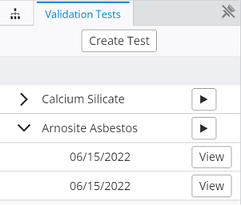
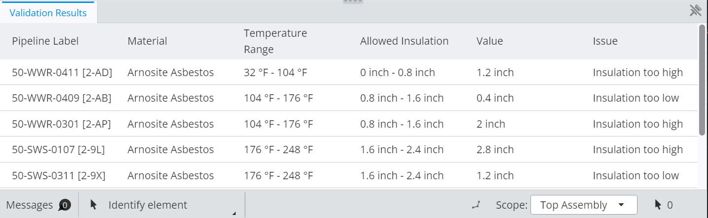

# Insulation Validation App

This repository is part of the iTwin.js validation API accreditation course. Please click here to access the full course content. This documentation provides a high-level overview of the validation app designed in the course. The key focus is how the custom UI components interact with the validation API.

The application is built on top the iTwin-Viewer which is a starter template for creating your own custom iTwin experience.

## Additional Dependencies

In addition to cloning the iTwin-Viewer, this app requires the following dependencies:

```"@itwin/itwinui-react": "^1.40.0",
"@itwin/itwinui-react": "^1.40.0",
"@itwin/property-validation-client": "^0.3.1",
"@itwin/ecschema-rpcinterface-common": "^3.1.3",
"date-fns": "^2.28.0",
```

## Overview

The ValidationUIItemsProvider provides two custom widgets to support validation workflow:

- ValidationTestWidget (right panel).



- ValidationResultWidget (bottom panel).



These widgets interact with the validation API in the following ways:

### ValidationTestWidget

- Fetches list of tests
- Fetches list of runs
- Fetches list of rules (for test creation)
- Creates tests
- Creates rules
- Runs tests
- Polls for run status
- Fetches run result

### ValidationResultWidget

- Receives results from ValidationTestWidget
- Fetches list of rules (to present with result)

### Other classes

1) ValidationLink: Leverages property-validation-client to make calls into the validation API.
2) iTwinLink: Queries iModel to get list of graphical elements associated with each pipeline.
3) Utils: Uses quantity formatter for unit conversion.

### iTwin UI Components used

- Table
- Modal
- Button
- Input
- ProgressRadial
- Select

## Walkthrough

The entry-point for the code is the Viewer component under the App.tsx. It takes in UIItemsProviders to provide custom widgets to extend the iTwin Viewer. More information on how to add widgets to the iTwinViewer can be found here (TK - insert link). In this case, the ValidationUIItemsProvider provides widgets that are located in the right and bottom panels of the app.

1) ValidationTestWidget (right): This widget acts as the entry-point for the validation workflow. It provides the ability to create new tests, rules, and runs. For creating new tests and rules, it uses modal menus that are presented when the "Create Test" button is clicked. Below this button all the validation tests and runs are listed. Once a test has been run, a view button is presented next to the run. This button fetches the run result data and sends it to the ValidationResultsWidget.

2) ValidationResultsWidget (bottom): The result widget receives the result from the test widget, and presents it in the form of a table. It also takes the elements ids of the pipelines that failed the validation test, sorts them based on issue type (insulation too high or too low), and colorizes the graphical elements associated with them using the emphasize and colorize APIs.
